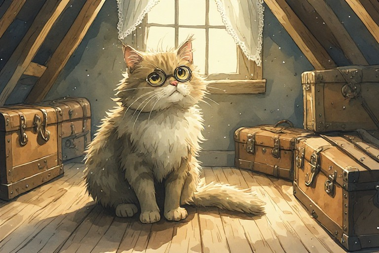

# 📚 Biblioteca — Contador de Histórias

Índice gerado pelo próprio app a cada sincronização. Não edite estes arquivos à mão:
o app reescreve o que precisar na próxima vez que abrir.

- [`livros/`](livros) — uma história por arquivo `.json` (texto + metadados)
- [`fichas/`](fichas) — a ficha de cada história (título, dados e a capa). É isso que os aparelhos baixam sozinhos; o livro inteiro só desce quando alguém o abre
- [`arte/`](arte) — as ilustrações, uma por arquivo
- [`_lixeira.json`](_lixeira.json) — o que foi apagado, para não voltar sozinho
- [`_conexao.json`](_conexao.json) — a chave (criptografada) do arquivo público que faz os aparelhos novos entrarem sozinhos; é ela que permite reatualizar essa conexão sem passar por um navegador específico

Total: **3** história(s).

| História | Gênero | Tom | Palavras | Ilustrações | Salva em |
|---|---|---|---|---|---|
| **[O Despertar de Luna](livros/hmuc08jj5-wmstv7.json)** | Infantil | Brincalhão | 466 | 4 | 21 de set. de 2026 |
| **[Uma violinista](livros/hmubxv5h1-acmhb8.json)** | Infantil | Brincalhão | 507 | 3 | 21 de set. de 2026 |
| **[O Gato Aristocrata](livros/hmualdi79-i2wud6.json)** | Infantil | Brincalhão | 548 | 4 | 20 de set. de 2026 |

## Capas

### O Gato Aristocrata

